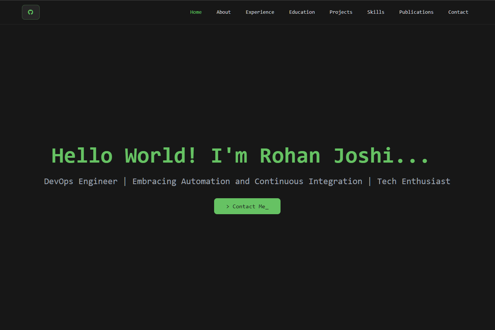

# 🚀 Personal Portfolio

 <!-- Optional: Add a preview image -->

## 📌 About  
This is my **personal portfolio website**, designed with a **terminal-inspired interface** to showcase my journey. It's fully **responsive, interactive, and open-source**.

## 🎨 Features  
✅ **Terminal-Style UI** – Aesthetic dark mode with CLI-like prompts.  
✅ **Dynamic Navigation** – Smooth scroll & active section highlighting.  
✅ **Expandable Project Cards** – Clickable cards for detailed project descriptions.  
✅ **GitHub Source Button** – Direct link to this repository.  
✅ **Fully Responsive** – Works seamlessly across devices.  

## 🛠️ Tech Stack  
- **HTML & Tailwind CSS** – Styling with responsive layouts  
- **JavaScript (Vanilla JS)** – Interactive elements & animations  
- **FontAwesome** – Icons for a clean, modern feel  
- **GitHub Pages** – Hosted directly on GitHub  

## 📂 Sections  
- **👨‍💻 About Me** – Introduction & professional background
- **💼 Work Experience** – Key roles & responsibilities
- **🎓 Education** - Academic background
- **📊 Projects** – DevOps & ML-based projects with descriptions
- **🛠️ Skills** – Tools & technologies expertise
- **📚 Publications** – Research & conference papers
- **📬 Contact** – Social links & email  

## 🚀 Getting Started  
To run the project locally:  
```sh
git clone https://github.com/yourusername/portfolio.git
cd portfolio
open index.html
```
